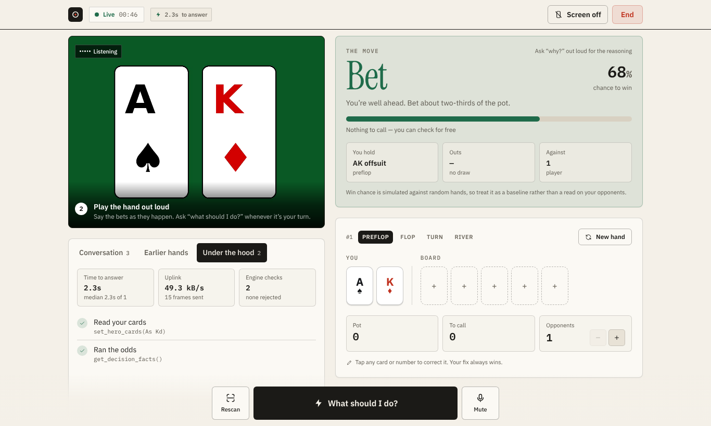
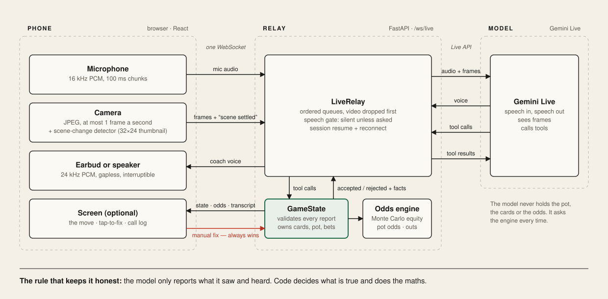
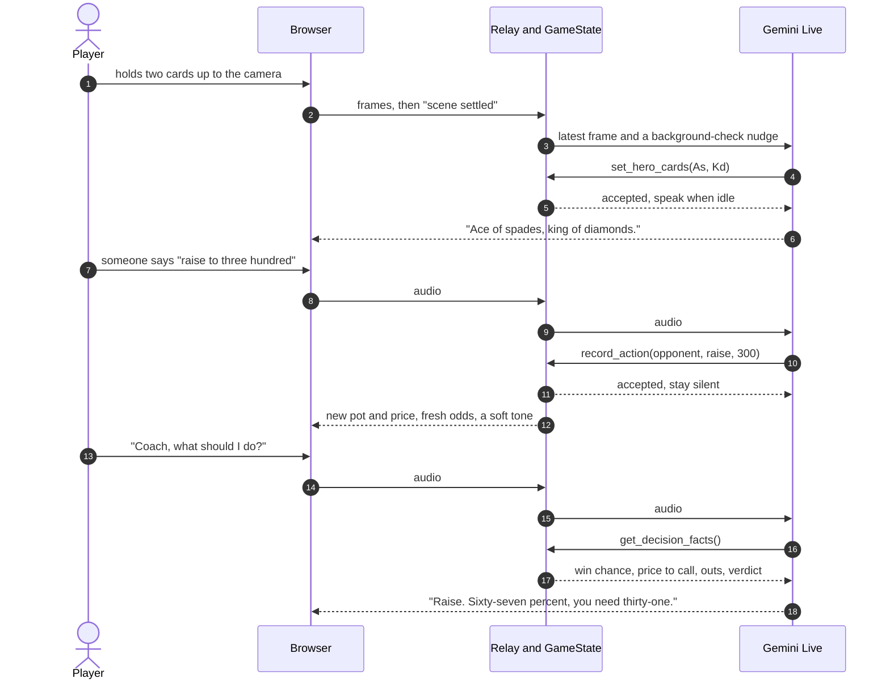

# PokerLens

**A poker coach in your ear, not on a screen.** Prop your phone up as the camera, put one earbud in and keep your eyes on the table. PokerLens sees your cards and the board, hears the bets, and tells you the move out loud.

It is built for a **physical** Texas Hold'em table, for practice and home games.

**[Open the live app](https://frontend-8937.vercel.app/)** · press **Watch a demo hand** to see it without a camera, a microphone or a server.



<sub>A real run through the deployed stack. The camera feed is a test video of two cards; the read, the odds and the 2.2 s answer are live.</sub>

## What it does

- **Reads the table.** Hold your two cards up once and it reads them back. The flop, turn and river are picked up as they land.
- **Listens to the game.** Bets, raises, calls and folds said out loud are logged, and the pot and the price to call update. It stays silent through table talk.
- **Answers when asked.** Say "Coach, what should I do?" or tap once. You hear the move and the one number behind it.
- **Works with the screen off.** Screen-off mode dims the display and turns the whole phone into a single button. Soft tones confirm that the board was read or a bet was heard.
- **Remembers the session.** "What did I have last hand?" is answered from a record of finished hands.

## Architecture



Three parts, one rule.

1. **The phone** is a sensor and a speaker. It streams 16 kHz microphone audio and at most one camera frame a second, and plays the coach's voice.
2. **The relay** (`backend/live_relay.py`) holds one streaming session with Gemini Live per player. It forwards media, mutes speech the player didn't ask for, and survives dropped connections.
3. **The engine** (`backend/game_state.py`) owns the hand. It validates every report and computes win chance, pot odds and outs.

**The rule: the model reports, code decides.** The model can only say what it saw or heard by calling a tool such as `set_board` or `record_action`. The engine checks each call (no duplicate cards, legal board sizes, consistent bets) and can reject it. The model never holds the pot or does arithmetic; before any advice it must call `get_decision_facts` and speak from the result.

### One hand, step by step



## Design decisions

| Decision | Why |
|---|---|
| The model calls tools; the engine owns the state | A language model will happily invent a pot size. Validated tool calls make every claim checkable and every mistake visible. |
| Silent by default | A coach that comments on table talk is unusable. The prompt says to stay quiet, and the relay also mutes audio from background checks in code, because prompts alone were not reliable. |
| The browser detects scene changes | The Live API does not start a turn on video alone. The browser compares 32×24 thumbnails, waits for the picture to settle, then asks the model to look. |
| Sound first, screen second | Everything needed mid-hand arrives by voice or tone. The screen is there to check the coach's work and to correct it. |
| A person can overrule the model | Tap any card or number to fix it. The fix goes straight to the engine and the model's next answer uses it. |
| Two layers of reconnection | The relay resumes the Gemini session when Google rotates it. If the phone's own link drops, the browser reconnects and restores the hand from its last snapshot. |
| Half-duplex unless you wear earbuds | On a loudspeaker the coach would hear itself. The mic pauses while it speaks; with earbuds it stays open and you can interrupt. |

## When things go wrong

| Situation | What happens |
|---|---|
| The model misreads a card | The engine rejects impossible reads (duplicates, a card already on the board). Anything else is one tap to fix. |
| The model speaks during table talk | Audio from background checks is dropped in the relay unless hole cards were just recorded. |
| Wi-Fi drops mid-hand | Up to three automatic reconnects. The hand, pot and history are restored; a falling tone and a rising tone mark the gap. |
| Google ends the streaming session | The relay reconnects with a resumption handle and carries on the same conversation. |
| The server is asleep, has no API key, or does not allow this site | The landing page checks before you start and names the problem. |
| No camera, or camera refused | The session runs by voice alone: say your cards and the board. |
| The phone tries to sleep | A screen wake lock is held for the session. |
| The room is too loud to talk | Push-to-talk mode, or type to the coach. |

## Measured

| What | Result | How it was measured |
|---|---|---|
| Tap "What should I do?" to first sound of the answer | 1.6–2.4 s, median 2.2 s | 5 runs in a headless browser through the deployed stack (Vercel, Render free tier, Gemini Live) |
| Odds calculation | about 45 ms | 1,500 Monte Carlo runs, flop, two opponents, on a development machine |
| Upload while streaming | about 49 kB/s | Audio plus frames as base64 JSON; shown live in the app under "Under the hood" |
| Backend tests | 45 passing | `pytest`, offline, with a scripted fake Gemini session |
| Browser flow checks | 38 passing | `frontend/qa/flow.mjs`, fake camera and mic, phone and desktop sizes |

The app shows its own answer time in the header and a running median under "Under the hood".

## Known limits

- **Card reading is verified on rendered test cards**, not yet across real decks, glare and odd angles.
- **Win chance is against random hands**, so it is a baseline, not a read on what opponents hold.
- **Who said what is unreliable** when several people talk. Bets are logged, but the speaker may be recorded as a generic opponent.
- **Turns that need several tool calls take longer**, around four to five seconds in earlier runs.
- **Audio goes up as base64 PCM.** Binary frames and Opus would cut the upload by roughly four times.
- **The model runs in the cloud.** Nothing here is on-device.

## What would change on a wearable

The phone is standing in for an ear-worn device with a camera. The parts that carry over unchanged are the relay, the engine, the tool contract and the speech gate. The parts that would change are the transport (Opus over a low-power link instead of base64 over a WebSocket), the trigger (an on-device change detector instead of browser JavaScript) and where the fast path runs (a small local model for card reading and wake phrases, with the cloud model for reasoning).

## Run it locally

```bash
# backend
cd backend
python -m venv venv && . venv/bin/activate        # Windows: .\venv\Scripts\activate
pip install -r requirements.txt
cp .env.example .env                               # add GEMINI_API_KEY; never commit it
uvicorn main:app --reload --port 8000

# frontend, in a second terminal
cd frontend
npm install && npm run dev                         # http://localhost:5173
```

Camera and microphone need HTTPS or `localhost`.

## Deploy

1. **Backend on Render.** Web service, root `backend`, build `pip install -r requirements.txt`, start `uvicorn main:app --host 0.0.0.0 --port $PORT`. Set `GEMINI_API_KEY` and `ALLOWED_ORIGINS=https://<your-app>.vercel.app`. Set `DEMO_PASSCODE` if the link is public, so strangers cannot spend your quota.
2. **Frontend on Vercel.** Root `frontend`, Vite preset, `VITE_API_URL=https://<your-backend>.onrender.com`.
3. Open the Vercel link on the phone. The landing page reports whether the server is awake and configured.

## Configuration

| Variable | Purpose |
|---|---|
| `GEMINI_API_KEY` | Required. |
| `LIVE_MODEL` | Live model, default `gemini-3.8-live`. |
| `ALLOWED_ORIGINS` | Comma-separated sites allowed to connect (CORS and the WebSocket origin check). |
| `DEMO_PASSCODE` | Optional access code required by `/ws/live`. |
| `MAX_LIVE_SESSIONS`, `LIVE_MAX_SECONDS` | Concurrent sessions and the per-session time cap. |
| `LIVE_VOICE`, `LIVE_API_VERSION`, `LIVE_PROACTIVE` | Optional voice name, API version and proactive audio. |
| `VITE_API_URL` (frontend) | Backend address, fixed at build time. |

## Tests

```bash
cd backend && pip install -r requirements-dev.txt && pytest      # offline, no key needed
python scripts/live_e2e.py --memory --vision                     # real Gemini Live API, needs a key
cd frontend && node qa/flow.mjs ./qa-shots                       # browser flow; setup is in the file header
```

## Repository map

```
backend/
  main.py              FastAPI app: /ws/live, /health, origin check, access code, session cap
  live_relay.py        Browser to Gemini Live relay: tools, prompt, speech gate, resumption
  game_state.py        The hand: validation, pot and bet maths, outs, verdict, hand history
  equity.py, cards.py  Monte Carlo equity and card parsing
  scripts/live_e2e.py  Smoke test against the real Live API
  tests/               pytest suite
frontend/src/
  live/useLiveSession.js   WebSocket, mic and camera, scene detection, reconnect and restore, wake lock
  live/audio.js            16 kHz mic worklet, gapless 24 kHz player, sound cues
  live/useDemoSession.js   Scripted hand for the demo button
  components/live/         Landing, Session, CardPicker, PlayingCard
frontend/qa/flow.mjs       Browser flow test
docs/                      Diagram and screenshots
```

The first prototype, which analysed one photo at a time, is still in the repository (`/analyze`, `frontend/src/App.jsx`) and reachable at `/?classic=1`.

## Responsible use

Most casinos and card rooms ban electronic aids in real-money games. Use PokerLens for practice, study and home games where everyone at the table knows it is listening. Audio and video are streamed to the model for the session and are not stored by this app.
